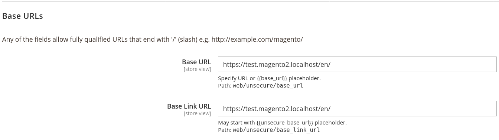
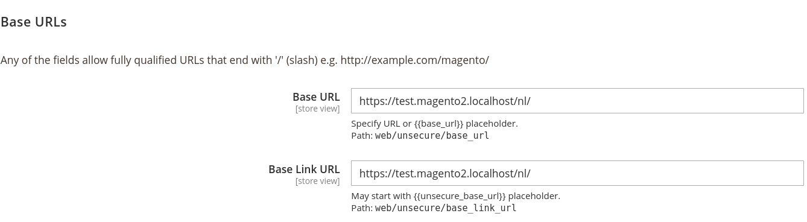
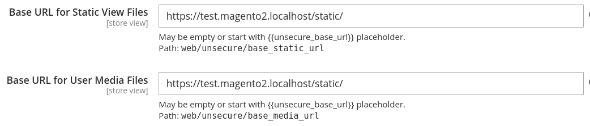

# Magento 2 - Elgentos_BaseUrlPath
Allow setting up a base url in system config other than root.

If you want to add `https://my.domain.tld/mypseronalurl/` after the baseurl Magento currently doesn't allow this.
You are left with adding the storecode to the path or creating subdirectories with extra files.

This can get ugly if you just want to add language codes(other than locale-codes) to your domain,
for example `https://my.domain.tld/en/` and `https://my.domain.tld/nl/`

## Installation: part 1 - Module via composer
Install the module via composer by running 

```bash
composer require elgentos/module-baseurlpath

bin/magento module:enable Elgentos_BaseUrlPath
bin/magento cache:flush
```

## Installation: part 2 - Nginx MAGE_RUN_CODE
Make sure you setup your `MAGE_RUN_CODE` mapping correctly. By default in Nginx this is only done based on **$host** name.

We will add the **$request_uri** to the mapping.

```nginx
# https://{host}/{language}/{magento_request}/
# Most specific match goes first
map $host$request_uri $mageRunCode {
  hostnames;
  default default;
  ~other.domain.tld/nl/ other_nl;
  ~other.domain.tld other_en;
  ~my.domain.tld/en/ site_en;
  ~my.domain.tld site_nl;
}

# fastcgi section
fastcgi_param MAGE_RUN_CODE $mageRunCode;
```

### Nginx without mapping
Or if Nginx mapping isn't available for you.

```nginx
# https://{host}/{language}/{magento_request}/
# Most specific match goes last
# this one is untested thought(sorry for that)

set $mageRunCode "default";
if ($host$request_uri ~ other.domain.tld/) {
    set $mageRunCode "other_en";
}
if ($host$request_uri ~ other.domain.tld/nl/) {
    set $mageRunCode "other_nl";
}
if ($host$request_uri ~ my.domain.tld/) {
    set $mageRunCode "site_nl";
}
if ($host$request_uri ~ my.domain.tld/en/) {
    set $mageRunCode "site_en";
}
```

## Configuration
After installation goto `Stores` / `Configuration` -> `General` / `Web` -> `Base URLs ((Un)Secure)`

**My strong advise setting these settings on website or store view level 
because making errors could potentially lock you out from the admin pages** 

## Store 1: site_en
Update your base url to `https://my.domain.tld/en/`


## Store 2: site_nl
Update your base url to `https://my.domain.tld/nl/`


## Static content and media
To make static content work with these settings, you explicitly need to setup these paths to the root(`/`) of your site.



## Authors

- [Jeroen Boersma](https://github.com/jeroenboersma)
- [Wouter Steenmeijer](https://github.com/woutersteen)
- [Peter Jaap Blaakmeer](https://github.com/peterjaap)


